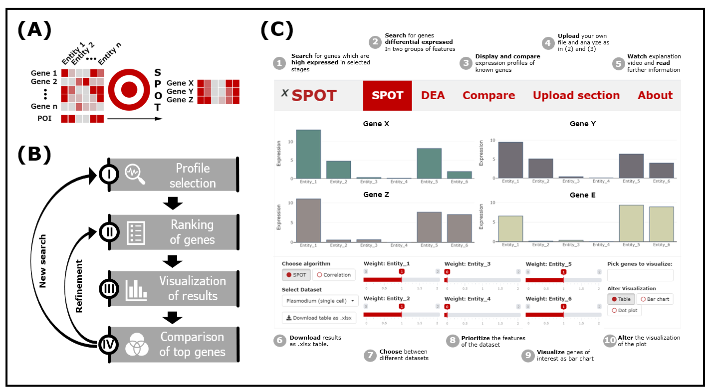
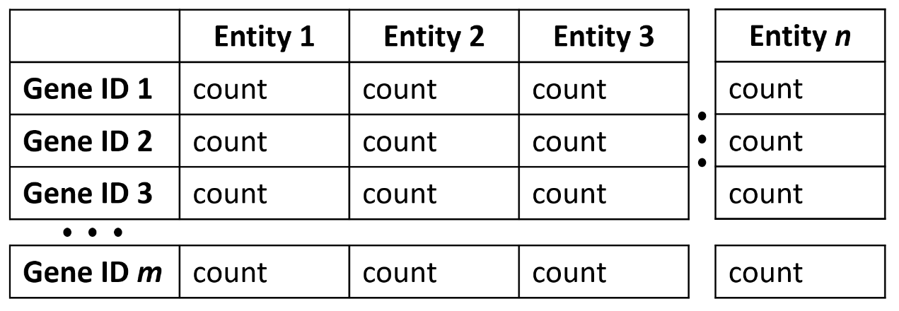

### SPOT - Swift Profiling of Transcriptomes

The increasing number of single cell and bulk RNAseq data sets describing complex gene expression profiles in different organisms, organs or cell types calls for an intuitive  tool allowing rapid comparative analysis. Here we present Swift Profiling Of Transcriptomes (SPOT) as a web tool that allows not only differential expression analysis but also fast ranking of genes fitting transcription profiles of interest. Based on a heuristic approach the spot algorithm ranks the genes according to their proximity to the user-defined gene expression profile of interest. The best hits are visualized as a table, bar chart or dot plot and can be exported as an Excel file. While the tool is generally applicable, we tested it on RNAseq data from malaria parasites that undergo multiple stage transformations during their complex life cycle as well as on data from multiple human organs during development. SPOT should enable non-bioinformaticians to easily analyse their own and any available dataset. 

### Installation

### Upload format

Files for upload should have entities as first row and a gene identifier as first column (see below and Example file). Counts should be in TPM normalization.

     

### Requirements

All code was excecuted with R 4.0.3. Package requirements are listed below:

package | version
--- | ---
DESeq2	| 1.30.0
DT	| 0.16
EnvStats	| 2.4.0
Limma| 3.46.0
MAST	| 1.16.0
matrixStats	| 0.57.0
Plotly	| 4.9.2.1
Plyr	| 1.8.6
Reshape2	| 1.4.4
Rlist| 	0.4.6.1
Scales	| 1.1.1
Seurat	| 3.2.2
Shiny	| 1.5.0
Shinybusy	| 0.2.2
Shinycssloaders	| 1.0.0
shinyEffects	| 0.1.0
Shinywidgets	| 0.5.4
Sortable	| 0.4.4
Stringr	| 1.4.0
Tidyr	| 1.3.0

Data was obtained from: 

Howick, V.M. u. a., 2019. The Malaria Cell Atlas: Single parasite transcriptomes across the complete Plasmodium life cycle. Science, 365(6455), S.774. [Paper](https://science.sciencemag.org/content/365/6455/eaaw2619) [Data](https://github.com/vhowick/MalariaCellAtlas/tree/master/Expression_Matrices/Smartseq2)

Cardoso-Moreira, M. u. a., 2019. Gene expression across mammalian organ development. Nature, 571(7766), S.505–509. [Paper](https://www.nature.com/articles/s41586-019-1338-5) [Data](https://www.ebi.ac.uk/arrayexpress/experiments/E-MTAB-6814/)

### Files

File | Use
--- | ---
ui.R | user interface (UI)
server.R | server code
helper_module.R | shiny modules and functions for UI and server
sc_P_berghei_counts.csv | *P. berghei* scRNAseq data from Howick *et al.* link XXX
sc_P_berghei_averaged.csv | *P. berghei* scRNAseq data, averaged for every lifecycle stage (annotation shortenedLifestage4 from Howick *et al.* 2019 link XXX)
sc_P_berghei_dotplot.csv | *P. berghei* scRNAseq data in dot plot file format 
sc_P_berghei_UMAP.csv | UMAP coordinates *P. berghei* scRNAseq data
bulk_H_sapiens_averaged.csv | *H. sapiens* bulkRNAseq data from Cardoso *et al.*, averaged for every developmental stage 

 
